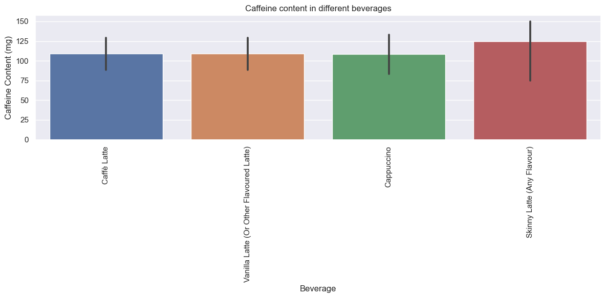
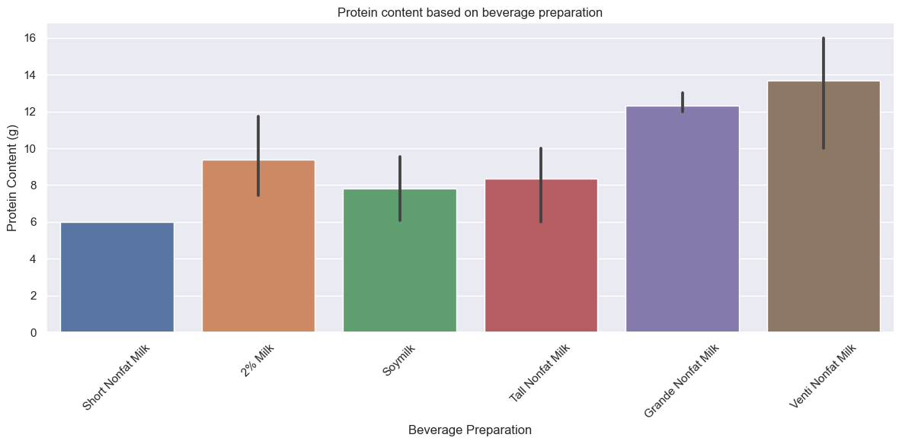
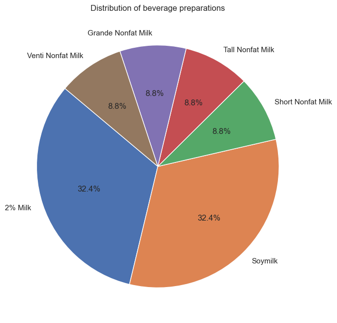
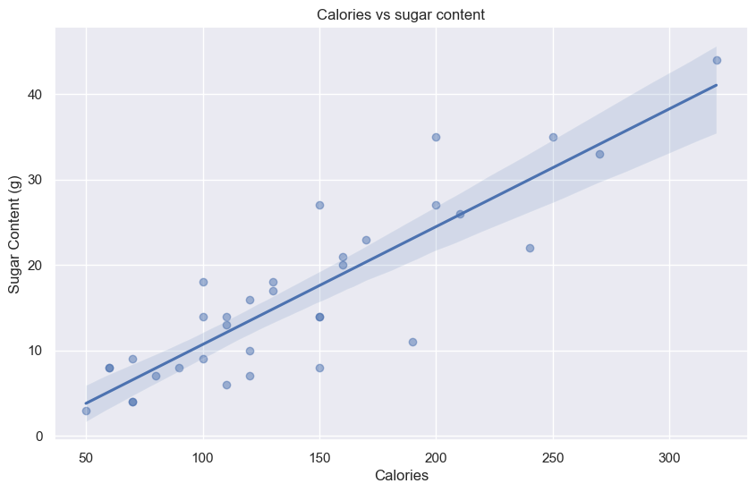

# Data analysis and visualization

This notebook is an example data analysis and visualization of a fictional starbucks dataset.

## Python csomagok


```python
import pandas as pd
import matplotlib.pyplot as plt
import numpy as np
import seaborn as sns

sns.set_theme(style = "darkgrid")
```

## Adatbetöltés és feltérképezés


```python
data = pd.read_csv("starbucks_data.csv",sep=';')
data.head(5)
```


<div>
<style scoped>
    .dataframe tbody tr th:only-of-type {
        vertical-align: middle;
    }

    .dataframe tbody tr th {
        vertical-align: top;
    }

    .dataframe thead th {
        text-align: right;
    }
</style>
<table border="1" class="dataframe">
  <thead>
    <tr style="text-align: right;">
      <th></th>
      <th>ID</th>
      <th>Beverage_category</th>
      <th>Beverage</th>
      <th>Beverage_prep</th>
      <th>Calories</th>
      <th>Total Fat (g)</th>
      <th>Total Carbohydrates (g)</th>
      <th>Sugars (g)</th>
      <th>Protein (g)</th>
      <th>Caffeine (mg)</th>
    </tr>
  </thead>
  <tbody>
    <tr>
      <th>0</th>
      <td>4</td>
      <td>Classic Espresso Drinks</td>
      <td>Caffè Latte</td>
      <td>Short Nonfat Milk</td>
      <td>70.0</td>
      <td>0.1</td>
      <td>75.0</td>
      <td>9.0</td>
      <td>6.0</td>
      <td>75.0</td>
    </tr>
    <tr>
      <th>1</th>
      <td>5</td>
      <td>Classic Espresso Drinks</td>
      <td>Caffè Latte</td>
      <td>2% Milk</td>
      <td>100.0</td>
      <td>3.5</td>
      <td>85.0</td>
      <td>9.0</td>
      <td>6.0</td>
      <td>75.0</td>
    </tr>
    <tr>
      <th>2</th>
      <td>6</td>
      <td>Classic Espresso Drinks</td>
      <td>Caffè Latte</td>
      <td>Soymilk</td>
      <td>70.0</td>
      <td>2.5</td>
      <td>65.0</td>
      <td>4.0</td>
      <td>5.0</td>
      <td>75.0</td>
    </tr>
    <tr>
      <th>3</th>
      <td>7</td>
      <td>Classic Espresso Drinks</td>
      <td>Caffè Latte</td>
      <td>Tall Nonfat Milk</td>
      <td>100.0</td>
      <td>0.2</td>
      <td>120.0</td>
      <td>14.0</td>
      <td>10.0</td>
      <td>75.0</td>
    </tr>
    <tr>
      <th>4</th>
      <td>8</td>
      <td>Classic Espresso Drinks</td>
      <td>Caffè Latte</td>
      <td>2% Milk</td>
      <td>150.0</td>
      <td>6.0</td>
      <td>135.0</td>
      <td>14.0</td>
      <td>10.0</td>
      <td>75.0</td>
    </tr>
  </tbody>
</table>
</div>


## Az adatokat a következőképpen kell értelmezni:

| Oszlop neve                | Leírás                                                  | Példa                           |
|----------------------------|---------------------------------------------------------|---------------------------------|
| ID                         | Az ital egyedi azonosítója, egész szám.                 | 4                               |
| Beverage_category          | Az ital kategóriája, szöveges formátumú.               | Classic Espresso Drinks         |
| Beverage                   | Az ital neve, szöveges formátumú.                       | Caffè Latte                     |
| Beverage_prep              | Az ital előkészítési módja, szöveges formátumú.         | Short Nonfat Milk               |
| Calories                   | Az ital kalóriatartalma, lebegőpontos szám.             | 70.0                            |
| Total Fat (g)              | Az ital teljes zsírtartalma grammban, lebegőpontos szám. | 0.1                           |
| Total Carbohydrates (g)    | Az ital teljes szénhidráttartalma grammban, lebegőpontos szám. | 75.0                         |
| Sugars (g)                 | Az ital cukortartalma grammban, lebegőpontos szám.    | 9.0                             |
| Protein (g)                | Az ital fehérjetartalma grammban, lebegőpontos szám.  | 6.0                             |
| Caffeine (mg)              | Az ital koffeintartalma milligrammban, lebegőpontos szám. | 75.0                         |


## Hibás értékek kezelése


```python
data.info()
data.describe()
```

    <class 'pandas.core.frame.DataFrame'>
    RangeIndex: 52 entries, 0 to 51
    Data columns (total 10 columns):
     #   Column                   Non-Null Count  Dtype  
    ---  ------                   --------------  -----  
     0   ID                       52 non-null     int64  
     1   Beverage_category        52 non-null     object 
     2   Beverage                 52 non-null     object 
     3   Beverage_prep            52 non-null     object 
     4   Calories                 40 non-null     float64
     5   Total Fat (g)            39 non-null     float64
     6   Total Carbohydrates (g)  39 non-null     float64
     7   Sugars (g)               39 non-null     float64
     8   Protein (g)              39 non-null     float64
     9   Caffeine (mg)            37 non-null     float64
    dtypes: float64(6), int64(1), object(3)
    memory usage: 4.2+ KB
    


<div>
<style scoped>
    .dataframe tbody tr th:only-of-type {
        vertical-align: middle;
    }

    .dataframe tbody tr th {
        vertical-align: top;
    }

    .dataframe thead th {
        text-align: right;
    }
</style>
<table border="1" class="dataframe">
  <thead>
    <tr style="text-align: right;">
      <th></th>
      <th>ID</th>
      <th>Calories</th>
      <th>Total Fat (g)</th>
      <th>Total Carbohydrates (g)</th>
      <th>Sugars (g)</th>
      <th>Protein (g)</th>
      <th>Caffeine (mg)</th>
    </tr>
  </thead>
  <tbody>
    <tr>
      <th>count</th>
      <td>52.000000</td>
      <td>40.000000</td>
      <td>39.000000</td>
      <td>39.000000</td>
      <td>39.000000</td>
      <td>39.000000</td>
      <td>37.000000</td>
    </tr>
    <tr>
      <th>mean</th>
      <td>30.884615</td>
      <td>181.250000</td>
      <td>3.043590</td>
      <td>117.948718</td>
      <td>26.794872</td>
      <td>12.871795</td>
      <td>111.486486</td>
    </tr>
    <tr>
      <th>std</th>
      <td>16.941252</td>
      <td>286.232714</td>
      <td>2.742434</td>
      <td>45.993677</td>
      <td>70.235386</td>
      <td>16.359738</td>
      <td>38.003378</td>
    </tr>
    <tr>
      <th>min</th>
      <td>4.000000</td>
      <td>50.000000</td>
      <td>0.100000</td>
      <td>40.000000</td>
      <td>3.000000</td>
      <td>3.000000</td>
      <td>75.000000</td>
    </tr>
    <tr>
      <th>25%</th>
      <td>16.750000</td>
      <td>97.500000</td>
      <td>0.300000</td>
      <td>80.000000</td>
      <td>8.000000</td>
      <td>6.000000</td>
      <td>75.000000</td>
    </tr>
    <tr>
      <th>50%</th>
      <td>29.500000</td>
      <td>120.000000</td>
      <td>3.000000</td>
      <td>120.000000</td>
      <td>14.000000</td>
      <td>9.000000</td>
      <td>75.000000</td>
    </tr>
    <tr>
      <th>75%</th>
      <td>46.250000</td>
      <td>175.000000</td>
      <td>5.000000</td>
      <td>150.000000</td>
      <td>21.500000</td>
      <td>12.000000</td>
      <td>150.000000</td>
    </tr>
    <tr>
      <th>max</th>
      <td>61.000000</td>
      <td>1900.000000</td>
      <td>9.000000</td>
      <td>220.000000</td>
      <td>450.000000</td>
      <td>90.000000</td>
      <td>150.000000</td>
    </tr>
  </tbody>
</table>
</div>


Látjuk hogy vannak null értékek, ezeket az adott oszlop átlagával helyettesítjük, miután az szélsőértékeket kiszűrtük a szórás alapján.


```python
# duplikált értékek szűrése
data = data.drop_duplicates()

# Outlierek szűrése
data = data[np.abs(data["Calories"]-data["Calories"].mean())<=(3*data["Calories"].std())]
data = data[np.abs(data["Total Fat (g)"]-data["Total Fat (g)"].mean())<=(3*data["Total Fat (g)"].std())]
data = data[np.abs(data["Total Carbohydrates (g)"]-data["Total Carbohydrates (g)"].mean())<=(3*data["Total Carbohydrates (g)"].std())]
data = data[np.abs(data["Sugars (g)"]-data["Sugars (g)"].mean())<=(3*data["Sugars (g)"].std())]
data = data[np.abs(data["Protein (g)"]-data["Protein (g)"].mean())<=(3*data["Protein (g)"].std())]
data = data[np.abs(data["Caffeine (mg)"]-data["Caffeine (mg)"].mean())<=(3*data["Caffeine (mg)"].std())]

# NaN értékek szűrése
data['Calories'].fillna(data['Calories'].mean(), inplace=True)
data['Total Fat (g)'].fillna(data['Total Fat (g)'].mean(), inplace=True)
data['Total Carbohydrates (g)'].fillna(data['Total Carbohydrates (g)'].mean(), inplace=True)
data['Sugars (g)'].fillna(data['Sugars (g)'].mean(), inplace=True)
data['Protein (g)'].fillna(data['Protein (g)'].mean(), inplace=True)
data['Caffeine (mg)'].fillna(data['Caffeine (mg)'].mean(), inplace=True)

# Mivel a Beverage_category csak 1 értéket tartalmaz, ezért azt elhagyjuk
data = data.drop(columns=['Beverage_category'])
```


```python
data
```


<div>
<style scoped>
    .dataframe tbody tr th:only-of-type {
        vertical-align: middle;
    }

    .dataframe tbody tr th {
        vertical-align: top;
    }

    .dataframe thead th {
        text-align: right;
    }
</style>
<table border="1" class="dataframe">
  <thead>
    <tr style="text-align: right;">
      <th></th>
      <th>ID</th>
      <th>Beverage</th>
      <th>Beverage_prep</th>
      <th>Calories</th>
      <th>Total Fat (g)</th>
      <th>Total Carbohydrates (g)</th>
      <th>Sugars (g)</th>
      <th>Protein (g)</th>
      <th>Caffeine (mg)</th>
    </tr>
  </thead>
  <tbody>
    <tr>
      <th>0</th>
      <td>4</td>
      <td>Caffè Latte</td>
      <td>Short Nonfat Milk</td>
      <td>70.0</td>
      <td>0.1</td>
      <td>75.0</td>
      <td>9.0</td>
      <td>6.0</td>
      <td>75.0</td>
    </tr>
    <tr>
      <th>1</th>
      <td>5</td>
      <td>Caffè Latte</td>
      <td>2% Milk</td>
      <td>100.0</td>
      <td>3.5</td>
      <td>85.0</td>
      <td>9.0</td>
      <td>6.0</td>
      <td>75.0</td>
    </tr>
    <tr>
      <th>2</th>
      <td>6</td>
      <td>Caffè Latte</td>
      <td>Soymilk</td>
      <td>70.0</td>
      <td>2.5</td>
      <td>65.0</td>
      <td>4.0</td>
      <td>5.0</td>
      <td>75.0</td>
    </tr>
    <tr>
      <th>3</th>
      <td>7</td>
      <td>Caffè Latte</td>
      <td>Tall Nonfat Milk</td>
      <td>100.0</td>
      <td>0.2</td>
      <td>120.0</td>
      <td>14.0</td>
      <td>10.0</td>
      <td>75.0</td>
    </tr>
    <tr>
      <th>4</th>
      <td>8</td>
      <td>Caffè Latte</td>
      <td>2% Milk</td>
      <td>150.0</td>
      <td>6.0</td>
      <td>135.0</td>
      <td>14.0</td>
      <td>10.0</td>
      <td>75.0</td>
    </tr>
    <tr>
      <th>5</th>
      <td>9</td>
      <td>Caffè Latte</td>
      <td>Soymilk</td>
      <td>110.0</td>
      <td>4.5</td>
      <td>105.0</td>
      <td>6.0</td>
      <td>8.0</td>
      <td>75.0</td>
    </tr>
    <tr>
      <th>6</th>
      <td>10</td>
      <td>Caffè Latte</td>
      <td>Grande Nonfat Milk</td>
      <td>130.0</td>
      <td>0.3</td>
      <td>150.0</td>
      <td>18.0</td>
      <td>13.0</td>
      <td>150.0</td>
    </tr>
    <tr>
      <th>8</th>
      <td>12</td>
      <td>Caffè Latte</td>
      <td>Soymilk</td>
      <td>150.0</td>
      <td>5.0</td>
      <td>130.0</td>
      <td>8.0</td>
      <td>10.0</td>
      <td>150.0</td>
    </tr>
    <tr>
      <th>9</th>
      <td>13</td>
      <td>Caffè Latte</td>
      <td>Venti Nonfat Milk</td>
      <td>170.0</td>
      <td>0.4</td>
      <td>190.0</td>
      <td>23.0</td>
      <td>16.0</td>
      <td>150.0</td>
    </tr>
    <tr>
      <th>10</th>
      <td>14</td>
      <td>Caffè Latte</td>
      <td>2% Milk</td>
      <td>240.0</td>
      <td>9.0</td>
      <td>220.0</td>
      <td>22.0</td>
      <td>16.0</td>
      <td>150.0</td>
    </tr>
    <tr>
      <th>11</th>
      <td>15</td>
      <td>Caffè Latte</td>
      <td>Soymilk</td>
      <td>190.0</td>
      <td>7.0</td>
      <td>170.0</td>
      <td>11.0</td>
      <td>13.0</td>
      <td>150.0</td>
    </tr>
    <tr>
      <th>24</th>
      <td>28</td>
      <td>Vanilla Latte (Or Other Flavoured Latte)</td>
      <td>Short Nonfat Milk</td>
      <td>100.0</td>
      <td>0.1</td>
      <td>70.0</td>
      <td>18.0</td>
      <td>6.0</td>
      <td>75.0</td>
    </tr>
    <tr>
      <th>25</th>
      <td>29</td>
      <td>Vanilla Latte (Or Other Flavoured Latte)</td>
      <td>2% Milk</td>
      <td>130.0</td>
      <td>3.5</td>
      <td>80.0</td>
      <td>17.0</td>
      <td>6.0</td>
      <td>75.0</td>
    </tr>
    <tr>
      <th>26</th>
      <td>30</td>
      <td>Vanilla Latte (Or Other Flavoured Latte)</td>
      <td>Soymilk</td>
      <td>110.0</td>
      <td>2.5</td>
      <td>60.0</td>
      <td>13.0</td>
      <td>5.0</td>
      <td>75.0</td>
    </tr>
    <tr>
      <th>27</th>
      <td>31</td>
      <td>Vanilla Latte (Or Other Flavoured Latte)</td>
      <td>Tall Nonfat Milk</td>
      <td>150.0</td>
      <td>0.2</td>
      <td>110.0</td>
      <td>27.0</td>
      <td>9.0</td>
      <td>75.0</td>
    </tr>
    <tr>
      <th>28</th>
      <td>32</td>
      <td>Vanilla Latte (Or Other Flavoured Latte)</td>
      <td>2% Milk</td>
      <td>200.0</td>
      <td>5.0</td>
      <td>125.0</td>
      <td>27.0</td>
      <td>9.0</td>
      <td>75.0</td>
    </tr>
    <tr>
      <th>29</th>
      <td>33</td>
      <td>Vanilla Latte (Or Other Flavoured Latte)</td>
      <td>Soymilk</td>
      <td>160.0</td>
      <td>4.0</td>
      <td>95.0</td>
      <td>20.0</td>
      <td>7.0</td>
      <td>75.0</td>
    </tr>
    <tr>
      <th>30</th>
      <td>34</td>
      <td>Vanilla Latte (Or Other Flavoured Latte)</td>
      <td>Grande Nonfat Milk</td>
      <td>200.0</td>
      <td>0.3</td>
      <td>140.0</td>
      <td>35.0</td>
      <td>12.0</td>
      <td>150.0</td>
    </tr>
    <tr>
      <th>31</th>
      <td>35</td>
      <td>Vanilla Latte (Or Other Flavoured Latte)</td>
      <td>2% Milk</td>
      <td>250.0</td>
      <td>6.0</td>
      <td>150.0</td>
      <td>35.0</td>
      <td>12.0</td>
      <td>150.0</td>
    </tr>
    <tr>
      <th>32</th>
      <td>36</td>
      <td>Vanilla Latte (Or Other Flavoured Latte)</td>
      <td>Soymilk</td>
      <td>210.0</td>
      <td>5.0</td>
      <td>120.0</td>
      <td>26.0</td>
      <td>9.0</td>
      <td>150.0</td>
    </tr>
    <tr>
      <th>34</th>
      <td>38</td>
      <td>Vanilla Latte (Or Other Flavoured Latte)</td>
      <td>2% Milk</td>
      <td>320.0</td>
      <td>9.0</td>
      <td>200.0</td>
      <td>44.0</td>
      <td>15.0</td>
      <td>150.0</td>
    </tr>
    <tr>
      <th>35</th>
      <td>39</td>
      <td>Vanilla Latte (Or Other Flavoured Latte)</td>
      <td>Soymilk</td>
      <td>270.0</td>
      <td>7.0</td>
      <td>160.0</td>
      <td>33.0</td>
      <td>12.0</td>
      <td>150.0</td>
    </tr>
    <tr>
      <th>37</th>
      <td>45</td>
      <td>Cappuccino</td>
      <td>2% Milk</td>
      <td>80.0</td>
      <td>3.0</td>
      <td>70.0</td>
      <td>7.0</td>
      <td>5.0</td>
      <td>75.0</td>
    </tr>
    <tr>
      <th>38</th>
      <td>46</td>
      <td>Cappuccino</td>
      <td>Soymilk</td>
      <td>50.0</td>
      <td>1.5</td>
      <td>40.0</td>
      <td>3.0</td>
      <td>3.0</td>
      <td>75.0</td>
    </tr>
    <tr>
      <th>39</th>
      <td>47</td>
      <td>Cappuccino</td>
      <td>Tall Nonfat Milk</td>
      <td>60.0</td>
      <td>0.1</td>
      <td>70.0</td>
      <td>8.0</td>
      <td>6.0</td>
      <td>75.0</td>
    </tr>
    <tr>
      <th>40</th>
      <td>48</td>
      <td>Cappuccino</td>
      <td>2% Milk</td>
      <td>90.0</td>
      <td>3.5</td>
      <td>80.0</td>
      <td>8.0</td>
      <td>6.0</td>
      <td>75.0</td>
    </tr>
    <tr>
      <th>41</th>
      <td>49</td>
      <td>Cappuccino</td>
      <td>Soymilk</td>
      <td>70.0</td>
      <td>3.0</td>
      <td>65.0</td>
      <td>4.0</td>
      <td>5.0</td>
      <td>75.0</td>
    </tr>
    <tr>
      <th>43</th>
      <td>51</td>
      <td>Cappuccino</td>
      <td>2% Milk</td>
      <td>120.0</td>
      <td>4.0</td>
      <td>100.0</td>
      <td>10.0</td>
      <td>8.0</td>
      <td>150.0</td>
    </tr>
    <tr>
      <th>45</th>
      <td>53</td>
      <td>Cappuccino</td>
      <td>Venti Nonfat Milk</td>
      <td>110.0</td>
      <td>0.2</td>
      <td>120.0</td>
      <td>14.0</td>
      <td>10.0</td>
      <td>150.0</td>
    </tr>
    <tr>
      <th>46</th>
      <td>54</td>
      <td>Cappuccino</td>
      <td>2% Milk</td>
      <td>150.0</td>
      <td>6.0</td>
      <td>135.0</td>
      <td>14.0</td>
      <td>10.0</td>
      <td>150.0</td>
    </tr>
    <tr>
      <th>47</th>
      <td>55</td>
      <td>Cappuccino</td>
      <td>Soymilk</td>
      <td>120.0</td>
      <td>4.5</td>
      <td>110.0</td>
      <td>7.0</td>
      <td>9.0</td>
      <td>150.0</td>
    </tr>
    <tr>
      <th>48</th>
      <td>58</td>
      <td>Skinny Latte (Any Flavour)</td>
      <td>Short Nonfat Milk</td>
      <td>60.0</td>
      <td>0.1</td>
      <td>80.0</td>
      <td>8.0</td>
      <td>6.0</td>
      <td>75.0</td>
    </tr>
    <tr>
      <th>50</th>
      <td>60</td>
      <td>Skinny Latte (Any Flavour)</td>
      <td>Grande Nonfat Milk</td>
      <td>120.0</td>
      <td>0.3</td>
      <td>160.0</td>
      <td>16.0</td>
      <td>12.0</td>
      <td>150.0</td>
    </tr>
    <tr>
      <th>51</th>
      <td>61</td>
      <td>Skinny Latte (Any Flavour)</td>
      <td>Venti Nonfat Milk</td>
      <td>160.0</td>
      <td>0.3</td>
      <td>200.0</td>
      <td>21.0</td>
      <td>15.0</td>
      <td>150.0</td>
    </tr>
  </tbody>
</table>
</div>


## Adatvizualizáció

### Koffein tartalom italok szerint


```python
plt.figure(figsize=(12, 6))
sns.barplot(x='Beverage', y='Caffeine (mg)', data=data)
plt.title('Caffeine content in different beverages')
plt.xlabel('Beverage')
plt.ylabel('Caffeine Content (mg)')
plt.xticks(rotation=90)
plt.tight_layout()
plt.show()
```


    

    


### Fehérje tartalom elkészítési módok szerint


```python
plt.figure(figsize=(12, 6))
sns.barplot(x='Beverage_prep', y='Protein (g)', data=data)
plt.title('Protein content based on beverage preparation')
plt.xlabel('Beverage Preparation')
plt.ylabel('Protein Content (g)')
plt.xticks(rotation=45)
plt.tight_layout()
plt.show()
```


    

    


### Elkészítési módok megoszlása


```python
beverage_prep_counts = data['Beverage_prep'].value_counts()

plt.figure(figsize=(10, 8))
beverage_prep_counts.plot(kind='pie', autopct='%1.1f%%', startangle=140)
plt.title('Distribution of beverage preparations')
plt.ylabel('')
plt.show()
```


    

    


### Kalória tartalom és cukor tartalom korrelációja


```python
plt.figure(figsize=(10, 6))
sns.regplot(x='Calories', y='Sugars (g)', data=data, scatter_kws={'alpha':0.5})
plt.title('Calories vs sugar content')
plt.xlabel('Calories')
plt.ylabel('Sugar Content (g)')
plt.show()

correlation = data['Calories'].corr(data['Sugars (g)'])
print('A kalória és a cukor közötti korreláció: ', correlation)
```


    

    


    A kalória és a cukor közötti korreláció:  0.8771254609018775
    
